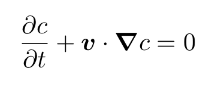
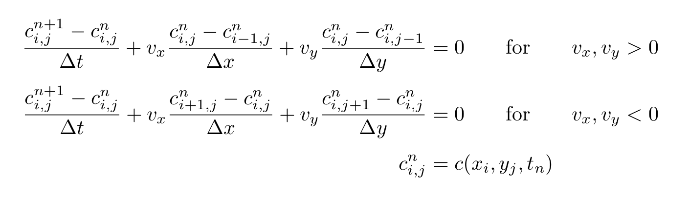
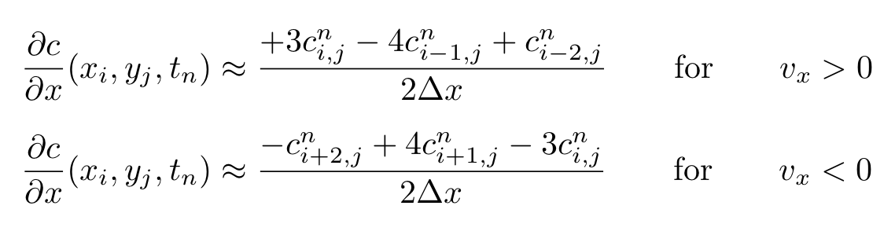
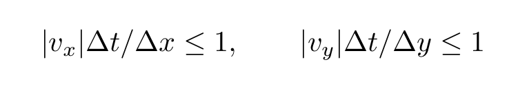

# Exercise 3 - Point-to-point communication

If the equations don't render in your viewer, you can view them at
least on Gitlab: https://version.aalto.fi/gitlab/manterm1/pps-example-codes/-/blob/main/exercise_sheets/sheet3/sheet.md

## Communication-time measurement 

Implement a simple point-to-point communication involving just two MPI processes and measure the communication time as a function of data package size for three different combinations out of the spectrum of the MPI send/recv routines.
For time measurement, use MPI_Wtime. (Consider, that the OpenMPI library doesn’t provide synchronization of the starting time across processes. So, you have to organize a proper synchronisation yourself.)

In particular, compare the case "both processes on the same node” with “processes on different nodes”.
The number of processes per node can be controlled by the SLURM option `--ntasks-per-node`.

Execution on a cluster is affected by random effects, hence the results will in general be subject to scatter.
Hence, for obtaining reliable mean values, you have to repeat the measurement at an appropriate rate.

Document your work in a separate PDF document containing
- a short description of the code,
- a graphical representation of the measured latency/bandwidth - package size relation,
- a short discussion of the results.

Bonus task: Compare communication performance (Bytes per second communicated) with compute
performance (FLOPS). FLOPS can be estimated by running and timing a long loop, e.g. adding two large arrays.

## A physical application case

Typical application cases of stencil computations are
partial differential equations. Analytical solutions are not available for most of the setups relevant in science and technology, so instead approximative numerical solutions have to be found. This requires discretization with respect to the involved coordinates, in general one or more spatial coordinates and the time.  
Consider the transport of an admixture with concentration $c$ by a fluid moving with velocity $\bm{v}$ in two spatial dimensions, $x$ and $y$. A simplified description is given by the advection equation 
$$
   \frac{\partial{c}}{\partial{t}} + \bm{v}\cdot\boldsymbol{\nabla} c = 0 \qquad \qquad (1)
$$
<!---

-->
where $c(x, y, t)$ is the concentration field, $t$ is the time, $\boldsymbol\nabla$ is the gradient operator and the dot marks the dot product.  The velocity vector $\bm{v}$ is assumed to be presrcibed.

When discretizing both the temporal and spatial derivatives using 1st order finite differences one obtains:
$$
   \frac{c_{i,j}^{n+1}-c_{i,j}^{n}}{\Delta t} + v_x \frac{c_{i,j}^n-c_{i-1,j}^n}{\Delta x} + v_y \frac{c_{i,j}^n-c_{i,j-1}^n}{\Delta y} =0  \qquad \text{for} \qquad v_x,v_y > 0 \\[1mm]
   \frac{c_{i,j}^{n+1}-c_{i,j}^{n}}{\Delta t} + v_x \frac{c_{i+1,j}^n-c_{i,j}^n}{\Delta x} + v_y \frac{c_{i,j+1}^n-c_{i,j}^n}{\Delta y} =0  \qquad \text{for} \qquad v_x,v_y < 0 \\[1mm]
          c_{i,j}^n  = c(x_i,y_j,t_n)
$$
<!---

-->
where the dependent variable $c$ is only defined in the discrete points $(x_i,y_j)$ of a regular grid in the $(x,y)$ plane with constant spacings $\Delta x$ and $\Delta y$.
For the time discretization, the simplest explicit method, the Euler method, was chosen and for the discretization in $x$ and $y$ the so-called upwind scheme: The difference formulae are unsymmetric, namely shifted against the direction of the "wind" components $u_x$ and $u_y$, respectively. That's why for positive $u_x$, the values  $c_{i-1,j}$  and  $c_{i,j}$  are involved and not  $c_{i-1,j}$  and $c_{i+1,j}$  as it were the case for a symmetric formula (which would be of second order). Upwinding is a measure to improve numerical stability. 
In this exercise, you shall solve the discretized advection equation on the 2D domain $0\le x \le 1$, $0\le y \le 1$, with grid
cell numbers $n_x$ and $n_y$, thus the spacings are $\Delta x = 1/N_x$, $\Delta y = 1/N_y$. Instead of the first order upwind scheme explained above, apply a second order scheme:
$$
   \frac{\partial c}{\partial x}(x_i,y_j,t_n) \approx  \frac{+3 c_{i,j}^n - 4 c_{i-1,j}^n + c_{i-2,j}^n}{2 \Delta x}   \qquad \text{for} \qquad v_x > 0 \\[2mm]
   \frac{\partial c}{\partial x}(x_i,y_j,t_n) \approx  \frac{-c_{i+2,j}^n + 4 c_{i+1,j}^n - 3 c_{i,j}^n}{2 \Delta x}   \qquad \text{for} \qquad v_x < 0 ,
$$
<!---

-->
and likewise for $y$. Numerical stability requires to obey the Courant-Friedrichs-Lewy condition
$$
   |v_x| \Delta t / \Delta x \le 1, \qquad |v_y| \Delta t / \Delta y \le 1
$$
<!---
.
-->
Note, that this form is derived for the 1st order scheme, hence giving only an orientation for the 2nd order one.

The solution is wave-like:
$$
    c(x,y,t)  = c_0(x - v_x t,y - v_y t), \quad \text{where} \quad c_0(x,y) = c(x,y,0)
$$
is the initial condition and $\bm{v}$ the phase velocity.

Write an MPI-based code for solving Eq. (1) by the described numerical scheme assuming a uniform velocity with choosable direction and strength. 
Decompose the 2D domain defined above into rectangular subdomains by splitting the $x$ and $y$ intervals in, say  $p_x$ and $p_y$ subintervals, respectively. Assign each subdomain with its corresponding part of the grid to an MPI process.
Each gridpoint shall reside in only one process, implying that the interfaces of the subdomains are **between** grid points.
Assume periodicity of the solution in both the $x$ and the $y$ direction, that is, the solution, say, in the interval $1\le x \le 2$ is thought to be the same as in $0\le x \le 1$, likewise for the $y$ direction.

Communication between the processes is required when points near an edge of a subdomain need to form the gradient of $c$. Define proper "halos" of the subdomains and establish the neighborhood relations between the processes (ranks).
Because of the condition of periodicity, the interconnect topology of the processes is that of a torus.

Implement the data transfer into the halos by one-sided communication (MPI_GET or MPI_PUT).  

Check the numerical result against the analytical solution.

